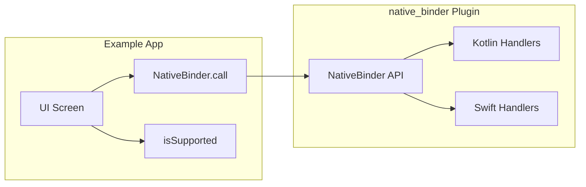

# Comprehensive Example for native_binder

## Package features to demonstrate

From the code and [README.md](README.md):

| Feature | Where |

|--------|--------|

| **Synchronous call** | `NativeBinder.call<T>(method, args)` |

| **Platform support** | `NativeBinder.isSupported` / `isSupportedPlatform` |

| **Typed return** | Generic `call<String>`, `call<int>`, `call<List<dynamic>>`, etc. |

| **All codec types** | String, int, double, bool, List, Map, null (args and return) |

| **Optional args** | `call('method')` with no args |

| **Native errors** | `NativeBinderException` (message, code, details) when native returns error envelope or method not found |

Currently the plugin registers only one handler (`echo`) in [android/.../NativeBinderPlugin.kt](android/src/main/kotlin/com/native_binder/NativeBinderPlugin.kt) and [ios/Classes/NativeBinderPlugin.swift](ios/Classes/NativeBinderPlugin.swift). The example needs more handlers to showcase all types and error handling.

---

## Approach

1. **Add an `example/` Flutter app** in the repo (standard `flutter create .` in `example/` or manual layout with `pubspec.yaml` depending on `native_binder` via path).
2. **Register extra demo handlers in the plugin** so the example app can call them without custom native code in the example app. Handlers to add:

   - **echo** (existing) – String in/out
   - **getCount** – no args → int
   - **getDouble** – no args → double
   - **getBool** – no args → bool
   - **getItems** – no args → List
   - **getConfig** – no args → Map
   - **getNull** – no args → null
   - **add** – args: List of two numbers → sum (demonstrates args: List)
   - **triggerError** – no args; handler throws (Kotlin) / returns error (Swift) so Dart gets `NativeBinderException` with code/message/details

3. **Example app UI**: one screen with sections that call each method and show the result; a section that calls an unknown method (or `triggerError`) and catches `NativeBinderException` to show message/code/details; and a guard for `NativeBinder.isSupported` (e.g. show “Not supported on this platform” on web/desktop).

---

## Implementation plan

### 1. Example app structure

- **example/pubspec.yaml** – Flutter app, dependency: `native_binder: path: ../`
- **example/lib/main.dart** – MaterialApp with a single screen (e.g. `NativeBinderExampleScreen`)
- **example/lib/screens/native_binder_example_screen.dart** (or in main.dart) – UI that:
  - Checks `NativeBinder.isSupported`; if false, shows a short message and disables/does not run calls.
  - For each demo method: button or auto-run on load that calls `NativeBinder.call<T>(...)`, displays result (e.g. in `Text` or list tiles).
  - For error: call `NativeBinder.call('unknownMethod')` or `NativeBinder.call('triggerError')` inside a try/catch, display `NativeBinderException.message`, `.code`, and `.details`.

### 2. Plugin: add demo handlers (Android)

In [android/src/main/kotlin/com/native_binder/NativeBinderPlugin.kt](android/src/main/kotlin/com/native_binder/NativeBinderPlugin.kt), after registering `echo`, register:

- `getCount` → `42`
- `getDouble` → `3.14`
- `getBool` → `true`
- `getItems` → `listOf("a", "b", 1, 2.0)`
- `getConfig` → `mapOf("key" to "value", "n" to 1)`
- `getNull` → `null`
- `add` → args as `List<*>`, take two numbers and return sum (int or double)
- `triggerError` → throw `RuntimeException("Demo error")` so the bridge encodes it as error (code/message/details)

### 3. Plugin: add demo handlers (iOS)

Same set of handlers in [ios/Classes/NativeBinderPlugin.swift](ios/Classes/NativeBinderPlugin.swift). Swift bridge currently does not wrap handler invocation in a catch to encode errors; only “method not found” is encoded. So either:

- **Option A**: Add a `triggerError` handler that returns normally but the Dart example only demonstrates error via **unknown method** (e.g. `NativeBinder.call('unknownMethod')`) so we get `not_found` and message. No need for Swift to encode thrown errors for this example.
- **Option B**: Extend [ios/Classes/NativeBinderBridge.swift](ios/Classes/NativeBinderBridge.swift) to catch errors from the handler and encode them (like Kotlin), then add `triggerError` that throws so both platforms show the same “triggered” error in the example.

Recommendation: **Option B** for parity and to showcase `NativeBinderException.details`; otherwise Option A is minimal and still shows exception on “unknown method”.

### 4. Example UI content (concise)

- **Support**: “Native bindings: supported / not supported”.
- **Echo**: TextField + button, call `echo` with the text, show result.
- **Primitives**: getCount, getDouble, getBool – show result.
- **Collections**: getItems, getConfig – show result (e.g. toString or simple list/map view).
- **Null**: getNull – show “null”.
- **Args**: add with [1, 2] and [2.5, 3.5] – show sums.
- **Error**: button “Trigger error” that calls `triggerError` (or “Unknown method” that calls `unknownMethod`), catch `NativeBinderException`, show message, code, details.

---

## File summary

| Action | File |

|--------|------|

| Add | `example/pubspec.yaml` |

| Add | `example/lib/main.dart` (and optionally `example/lib/screens/...`) |

| Add | `example/README.md` (short: how to run, what it demonstrates) |

| Modify | [android/.../NativeBinderPlugin.kt](android/src/main/kotlin/com/native_binder/NativeBinderPlugin.kt) – register all demo handlers |

| Modify | [ios/Classes/NativeBinderPlugin.swift](ios/Classes/NativeBinderPlugin.swift) – register same handlers |

| Optional | [ios/Classes/NativeBinderBridge.swift](ios/Classes/NativeBinderBridge.swift) – catch handler errors and encode (if Option B) |

---

## Flow (high level)

No change to the existing Dart API or C ABI; only new handlers and one new example app.