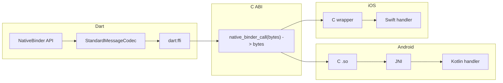

# Sync Native Binder: Plugin Tool for Dart ↔ Kotlin/Swift (JNI/FFI)

## Goals

- **Synchronous** calls from Dart to native (no MethodChannel / no async).
- **Types**: String, Int, Double, Boolean, List, Map — as arguments and return values.
- **Platforms**: Android (Kotlin + JNI), iOS (Swift + FFI).
- **Tool**: Enable **creating** plugins that use this bridge (codegen + runtime).

---

## Architecture

- **Dart**: Encode method name + args with `StandardMessageCodec` → pass bytes via FFI → decode response bytes → return typed result.
- **Single C ABI**: Same signature on both platforms so Dart has one code path and loads the right library per platform (e.g. `.so` on Android, `.framework`/`.dylib` on iOS).
- **Android**: C in a `.so` uses JNI to call Kotlin. Kotlin decodes bytes (same codec format), dispatches by method name, encodes result, returns bytes to C → Dart.
- **iOS**: C wrapper in the framework calls Swift. Swift decodes, dispatches, encodes, returns bytes to C → Dart.

---

## Message Format and Types

- **Encoding**: Use Flutter’s **StandardMessageCodec** (binary) on the Dart side so List, Map, String, int, double, bool are supported without reimplementing the codec in Dart.
- **Native**: Implement a **subset** of the same codec in Kotlin and Swift (decode incoming args, encode return value). Focus on: null, bool, int (32/64), double, String, List, Map. This matches your required types and keeps Dart ↔ native interchange consistent.

---

## Project Layout (native_binder as the “tool” package)

- **Runtime (Dart)**  
  - `lib/`: Public API (e.g. `NativeBinder.call<T>(method, args)`), FFI bindings to `native_binder_call`, and use of `StandardMessageCodec` for encode/decode.
- **Native C ABI**  
  - Single function, e.g. `uint8_t* native_binder_call(uint8_t* msg, size_t len, size_t* out_len)` (or equivalent with pointer + length in/out). Implemented once in C for each platform:
  - **Android**: C in `android/` that compiles to `.so` and uses JNI to call into Kotlin.
  - **iOS**: C in `ios/` (or inside the framework) that calls Swift (Swift implements the actual handler; C only exposes the ABI).
- **Android Kotlin**  
  - JNI entry from C → Kotlin “dispatcher” that decodes the message (method name + args), calls the right plugin method, encodes result, returns byte array to C.
  - Small **Kotlin codec** (reader/writer) for the same binary format (subset above).
- **iOS Swift**  
  - C calls Swift; Swift dispatcher decodes, calls plugin method, encodes result, returns bytes.
  - Small **Swift codec** (reader/writer) for the same binary format.
- **Plugin “creation” (tool)**  
  - **Option A (recommended for v1)**: No codegen; plugin authors:
    - Depend on `native_binder`.
    - Register handlers on native side (Kotlin/Swift) with a method name and a closure that takes decoded args (List/Map/primitives) and returns a value (same types).
    - Call from Dart: `NativeBinder.call('methodName', [arg1, arg2])` (with optional generic for return type).
  - **Option B (later)**: Code generator (e.g. `dart run native_binder:generate` or build_runner) that reads a config (method names/signatures) and generates Dart wrappers and native stub files so plugins get a typed Dart API and empty Kotlin/Swift implementations to fill in.

---

## Key Implementation Details

1. **Library loading**  

   - Use `dart:ffi` `DynamicLibrary.open()` with a platform-specific library name/path (e.g. Android: `libnative_binder.so`, iOS: framework or dylib name). Flutter plugin layout can ship the `.so` and the framework next to the Dart code.

2. **C ABI design**  

   - Keep it to a single function: input = pointer + length (encoded message), output = pointer + length (encoded result). Memory: native side allocates output buffer; Dart/FFI copies it and then calls a native “free” if needed, or use a shared allocator agreed between Dart and native.

3. **Android JNI**  

   - C code in the plugin’s `android/` builds to `.so`, attaches to JVM, finds the Kotlin “bridge” class, calls a static method like `byte[] handleCall(byte[] input)`, and returns the result pointer/length to Dart. Plugin app (or plugin registration) ensures the Kotlin class is loaded before any Dart call.

4. **iOS**  

   - Same C signature; implementation is a C function that calls into Swift (e.g. Swift `@_cdecl("native_binder_call")` or a thin C wrapper that calls Swift). Framework or dylib is linked so Dart can open it.

5. **Codec on native**  

   - Implement only the subset needed: null, bool, int, double, String, List, Map. Use the same type bytes and size encoding as Flutter’s StandardMessageCodec so that Dart’s `encodeMessage`/`decodeMessage` output is directly decodable on Kotlin/Swift and vice versa.

6. **Threading**  

   - Sync calls block the Dart isolate. Document that heavy work should be avoided on the calling thread, or consider a separate “worker” API later. No change to the core design.

---

## Suggested Phasing

- **Phase 1**: Dart API + FFI + C ABI + **Android** (C + JNI + Kotlin codec + dispatcher) for a single test method (e.g. pass String, return String).
- **Phase 2**: **iOS** (C + Swift codec + dispatcher), same test.
- **Phase 3**: Extend codec and dispatcher to full type set (List, Map, primitives) on both platforms; add registration API so plugin authors can register handlers by name.
- **Phase 4**: Optional codegen for “create plugin” experience (typed Dart API + native stubs).

---

## Files to Add / Touch

| Area | Path / file |

|------|---------------------|

| Dart API | [lib/native_binder.dart](lib/native_binder.dart) — replace placeholder with `NativeBinder` class and codec + FFI usage |

| Dart FFI | e.g. `lib/src/ffi/bindings.dart` (and generated or hand-written bindings for `native_binder_call`) |

| Dart codec | Use `flutter/services` `StandardMessageCodec` (no new file; dependency on Flutter SDK) |

| C ABI | `android/src/main/cpp/native_binder_jni.c` (or similar); `ios/...` C wrapper (e.g. in a Runner or plugin framework) |

| Android Kotlin | e.g. `android/.../NativeBinderPlugin.kt` (JNI entry + dispatcher), `android/.../MessageCodec.kt` (decode/encode) |

| iOS Swift | e.g. `ios/Classes/...` — Swift bridge + codec + dispatcher |

| Plugin registration | Kotlin/Swift API to register a method name → handler (args → result) |

| Tool / codegen (Phase 4) | e.g. `tool/generate.dart` or `build.yaml` + build_runner |

---

## Open Choices (for you to decide)

- **Plugin structure**: Should `native_binder` be a **dependency** of each plugin (each plugin has its own android/ios and includes the C + Kotlin/Swift bridge), or a **single plugin** that other plugins extend (e.g. register handlers with a global dispatcher)? The above assumes “dependency”: each plugin ships its own small C + native code that uses the same ABI and codec.
- **Codegen**: Start with manual registration (Option A) or invest in codegen from day one (Option B).
- **Return type safety**: Keep `NativeBinder.call<T>(...)` with generic `T` and cast decoded result to `T`, or later add codegen that generates typed methods (e.g. `MyPlugin.getCount() -> int`).

This plan gives you a concrete path to a synchronous Dart ↔ Kotlin/Swift bridge with your chosen types and a clear “tool for creating plugins” story (registration API now, optional codegen later).