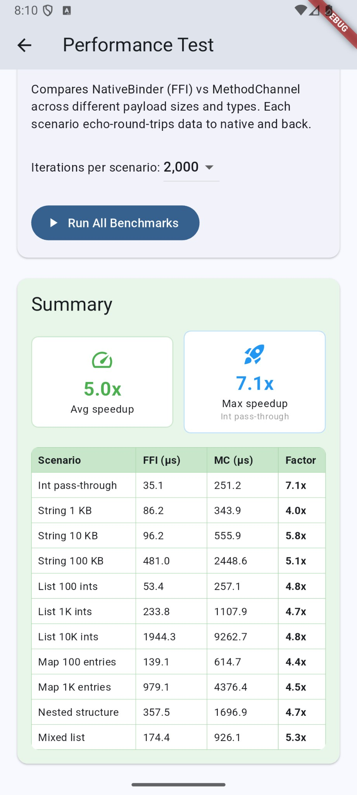

# native_binder

**Synchronous bidirectional bridge** between Dart and native code: call Kotlin/Swift from Dart AND call Dart from Kotlin/Swift with a single API—no `MethodChannel`, no async.

## Features

- **Dart → Native calls**: `NativeBinder.call<T>(method, args)` blocks and returns the decoded result.
- **Native → Dart calls**: `NativeBinderBridge.callDart<T>(method, args)` (Kotlin) or `callDartHandler(method, args)` (Swift).
- **Typed interchange**: String, int, double, bool, List, Map (and null) in both directions, using the same binary format as Flutter's `StandardMessageCodec`.
- **Android**: Dart ⟷ FFI ⟷ C ABI ⟷ JNI ⟷ Kotlin. Register handlers by method name.
- **iOS**: Dart ⟷ FFI ⟷ C ABI ⟷ Swift. Same registration pattern.

Heavy work on the calling thread blocks the Dart isolate or native thread; avoid long-running work.

## Getting started

Add the package to your Flutter plugin or app:

```yaml
dependencies:
  native_binder: ^0.0.1
```

Use it only on Android and iOS; on other platforms `NativeBinder.isSupported` is false and `call` throws.

## Usage

### Dart → Native Calls

**Dart side:**
```dart
import 'package:native_binder/native_binder.dart';

// Check support (e.g. before calling)
if (NativeBinder.isSupported) {
  final result = NativeBinder.call<String>('echo', 'hello');
  print(result); // hello
}

// Primitives and collections
final n = NativeBinder.call<int>('getCount');
final list = NativeBinder.call<List<dynamic>>('getItems');
final map = NativeBinder.call<Map<dynamic, dynamic>>('getConfig');

// Error handling
try {
  NativeBinder.call<void>('unknownMethod');
} on NativeBinderException catch (e) {
  print('Error: ${e.message} (code: ${e.code})');
}
```

**Android (Kotlin) - Register native handlers:**
```kotlin
import com.native_binder.NativeBinderBridge

NativeBinderBridge.register("echo") { args ->
  args  // Echo back the value
}

NativeBinderBridge.register("getCount") { _ -> 42 }

NativeBinderBridge.register("add") { args ->
  val list = args as List<*>
  (list[0] as Int) + (list[1] as Int)
}
```

**iOS (Swift) - Register native handlers:**
```swift
import native_binder

registerNativeBinderHandler("echo") { args in
  return args
}

registerNativeBinderHandler("getCount") { _ in 42 }

registerNativeBinderHandler("add") { args in
  let list = args as! [Any]
  return (list[0] as! Int) + (list[1] as! Int)
}
```

### Native → Dart Calls

**Dart side - Initialize and register handlers:**
```dart
import 'package:native_binder/native_binder.dart';

void main() {
  // Initialize bidirectional binding (required for Native→Dart)
  NativeBinder.initialize();

  // Register Dart handlers
  NativeBinder.register('greet', (args) {
    final name = (args as List)[0] as String;
    return 'Hello from Dart, $name!';
  });

  NativeBinder.register('multiply', (args) {
    final list = args as List;
    return (list[0] as num) * (list[1] as num);
  });

  runApp(MyApp());
}
```

**Android (Kotlin) - Call Dart handlers:**
```kotlin
import com.native_binder.NativeBinderBridge

// Call Dart handler from Kotlin
val greeting = NativeBinderBridge.callDart<String>("greet", listOf("Android"))
println(greeting)  // "Hello from Dart, Android!"

val product = NativeBinderBridge.callDart<Number>("multiply", listOf(6, 7))
println(product)  // 42

// Error handling
try {
  NativeBinderBridge.callDart<String>("unknownMethod")
} catch (e: RuntimeException) {
  println("Error: ${e.message}")
}
```

**iOS (Swift) - Call Dart handlers:**
```swift
import native_binder

do {
  // Call Dart handler from Swift
  let greeting = try callDartHandler("greet", args: ["iOS"]) as? String
  print(greeting ?? "")  // "Hello from Dart, iOS!"

  let product = try callDartHandler("multiply", args: [6, 7]) as? NSNumber
  print(product ?? 0)  // 42
} catch {
  print("Error: \(error.localizedDescription)")
}
```

## How it works

### Dart → Native
1. Dart encodes method name + arguments with `StandardMessageCodec`, passes bytes to native via FFI.
2. C ABI function `native_binder_call` is invoked.
3. **Android**: C uses JNI to call Kotlin; Kotlin decodes, dispatches by method name, encodes result, returns bytes.
4. **iOS**: C calls Swift directly; Swift does the same decode → dispatch → encode.
5. Result flows back to Dart through FFI.

### Native → Dart
1. Native encodes method name + arguments with `StandardMessageCodec`.
2. **Android**: Kotlin calls JNI function `callDartNative` which invokes Dart callback via FFI.
3. **iOS**: Swift calls `callDartFromNative` which invokes Dart callback via FFI.
4. Dart dispatcher looks up registered handler by method name, executes it.
5. Dart encodes result and returns to native.
6. Native decodes and returns to caller.

Both directions use the same encoding/error envelope format for consistency.

## Performance

NativeBinder's FFI-based approach is significantly faster than Flutter's MethodChannel for synchronous round-trip calls. The example app includes a built-in benchmark that compares the two across a range of payload sizes and types.

<p align="center">
  
</p>

### Benchmark scenarios

Each scenario echo-round-trips data to native and back. Results are averaged over configurable iterations (100–2,000).

| Scenario | Description |
|---|---|
| Int pass-through | Single integer round-trip |
| String 1–100 KB | String echo at various sizes |
| List 100–10K ints | Integer list round-trip at various lengths |
| Map 100–1K entries | Key-value pair round-trip |
| Nested structure | Nested maps + lists (breadth=3, depth=4) |
| Mixed list | 500 items mixing strings, ints, doubles, bools, and nulls |

### Typical results (Android)

| Scenario | FFI (μs) | MethodChannel (μs) | Speedup |
|---|---|---|---|
| Int pass-through | 35 | 251 | **7.1x** |
| String 1 KB | 86 | 344 | **4.0x** |
| String 10 KB | 96 | 556 | **5.8x** |
| String 100 KB | 481 | 2,449 | **5.1x** |
| List 100 ints | 53 | 257 | **4.8x** |
| List 1K ints | 234 | 1,108 | **4.7x** |
| List 10K ints | 1,944 | 9,263 | **4.8x** |
| Map 100 entries | 139 | 615 | **4.4x** |
| Map 1K entries | 979 | 4,376 | **4.5x** |
| Nested structure | 358 | 1,697 | **4.7x** |
| Mixed list | 174 | 926 | **5.3x** |

> **~5x average speedup, up to 7x** on lightweight payloads. Results vary by device and payload; run the benchmark on your own hardware via the example app's Performance Test screen.

### Running the benchmark

```bash
cd example
flutter run
```

Navigate to **Performance Test** from the home screen, choose an iteration count, and tap **Run All Benchmarks**.

## Additional information

- **Initialization**: For Native→Dart calls, you must call `NativeBinder.initialize()` once before native code can invoke Dart handlers. Safe to call multiple times.
- **Error handling**:
  - Dart→Native: Native throws → Dart receives `NativeBinderException` with code, message, and details.
  - Native→Dart: Dart throws → Native receives `RuntimeException` (Android) or `NSError` (iOS).
- **Thread safety**: Dart handlers run on the Dart isolate thread. Native handlers run on the calling thread.
- **Memory management**: Both directions properly allocate and free buffers automatically.
- **Plugin layout**: This package is a Flutter plugin that ships the C ABI and native code for Android and iOS. Other plugins can depend on it and register their own handlers.
- **See also**: Check the [example app](example/) for complete demonstrations of all features.
